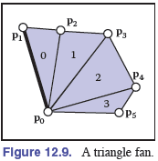
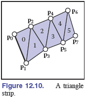

# 图形的数据结构

这个篇章会讲述几种基础的无关分类的数据结构，他们都很常见和有用：网格数据结构、空间数据结构、场景图和平铺多维数组。

## 12.1 三角形网格(Triangle Meshes)

现实世界中大多数模型都是由共享顶点的三角形复合物组成。

### 12.1.1 网格拓扑(Mesh Topology)

很多算法只能工作在具有可预测性的连接的网格上，或更容易在其上面实现。最简单且最严格的要求是，在网格的拓扑结构上，曲面是一个流行（manifold）。一个流行的网格是“防水”的，它没有间隙，将空间分成内部和外部。

manifold的判断条件：

- 每条边只能被一个或两个三角形拥有。
- 每个顶点都l连接着一组三角形，它们的边是连续的。

最后，对于区分mesh的表面和里面，一般三角形顶点顺序为逆时针顺序的表面当作正面（上面），顺时针的当作反面（下面）。

### 12.1.2 Indexed Mesh存储结构

最简单，最原始的记录法

``` 
// Triangle
Triangle {
    vector3 vertexPosition[3];
}
```

顶点单独存，三角形存储顶点下标

``` c
// IndexedMesh
Triangle {
    Vertex v[3];
}
Vertex {
    vector3 position;
}
```

最终网格的实际存储结构如下

``` c
// IndexedMesh
IndexedMesh {
    int tInd[nt][3]; // nt: triangle的数量
    vector3 vertes[nv]; // nv: 顶点的数量
}
```

空间复杂度比较

- Triangle: 每个三角形三个顶点，每个顶点三个整数，所以9nt。
- IndexedMesh: 每个三角形三个索引，每个顶点三个整数，所以3nt + 3nv。

### 12.1.3 三角形的带状和扇形状（Triangle Strips and Fans）

这两种结构都是为了优化IndexedMesh的空间利用率。

- Fans

  

  fan = [0, 1,  2, 3, 4, 5]

  从这个列表中解析出来的三角形列表是

  [(0, 1, 2), (0, 2, 3), (0, 3, 4), (0, 4, 5)]

- Strips

  

  strips: [0, 1, 2, 3, 4, 5, 6, 7]

  从这个列表中解析出来的三角形列表是

  [(0, 1, 2), (2, 1, 3), (2, 3, 4), (4, 3, 5), (4, 5, 6), (6, 5, 7)]

